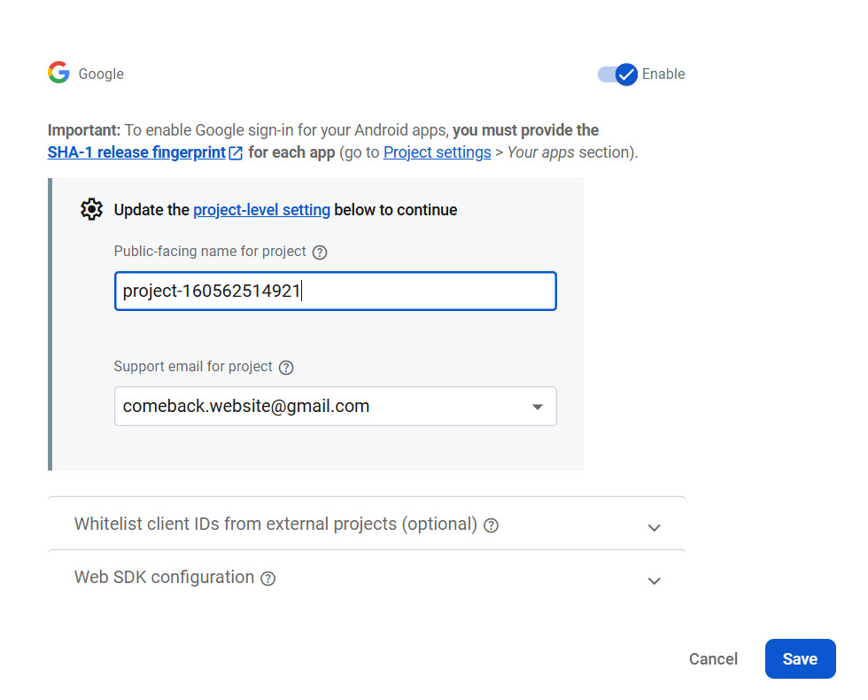

# Authentication

## Run this command
To find **SHA-1** run this command
```
keytool -list -v -keystore %USERPROFILE%\.android\debug.keystore -alias androiddebugkey -storepass android -keypass android
```
## Got this Output
```
Alias name:androiddebugkey
Creation date: 08-May-2024
Entry type: PrivateKeyEntry
Certificate chain length: 1
Certificate[1]:
Owner: C=US, O=Android, CN=Android Debug
Issuer: C=US, O=Android, CN=Android Debug
Serial number: 1
Valid from: Wed May 08 12:52:06 IST 2024 until: Fri May 01 12:52:06 IST 2054
Certificate fingerprints:
         SHA1: 5D:51:45:2F:1D:BB:8E:3C:A2:4E:C6:0D:BD:B9:A4:D9:2E:FF:91:1D
         SHA256: 30:F2:99:AF:87:C1:CA:EA:09:A6:CA:D5:FC:0B:64:BD:53:82:5D:95:6B:8E:5E:8E:48:DB:D3:64:03:FF:26:DF
Signature algorithm name: SHA256withRSA
Subject Public Key Algorithm: 2048-bit RSA key
Version: 1
```

i then used this to make touch named project in firebase 

then i am going to this link to setup firebase
https://rnfirebase.io/

Installation for React Native CLI (non-Expo)
i had run this - npm install --save @react-native-firebase/app

it showed me this many warnings
..............
npm warn deprecated rimraf@3.0.2: Rimraf versions prior to v4 are no longer supported

added 67 packages, removed 116 packages, changed 3 packages, and audited 1025 packages in 2m

158 packages are looking for funding
  run `npm fund` for details

11 vulnerabilities (8 low, 2 moderate, 1 high)

To address issues that do not require attention, run:
  npm audit fix

To address all issues (including breaking changes), run:
  npm audit fix --force

Run `npm audit` for details.
..................


then i had downloaded the google-services.json file and placed it in /android/app/google-services.json.

addded this line in /android/build.gradle file:

buildscript {
  dependencies {
    // ... other dependencies
    classpath("com.google.gms:google-services:4.4.2")
  }
}

then in /android/app/build.gradle file:
i added this
apply plugin: 'com.android.application'
apply plugin: "com.google.gms.google-services" // <- Add this line

then i enabled the authentication click google as provider and then enabled it


then go to settings in firebase and then added the fingerprints of sha 1 and 256

then again downloaded the google-services.json file and replaced it with the old one

then i go to https://console.cloud.google.com/apis/credentials to find webclientid

then inside credentials i find the key in 
    OAuth 2.0 Client IDs which has 
        Web client (auto-created by Firebase)

then i created the .env file and placed the key there

then i run this
npm install @react-native-firebase/app @react-native-firebase/auth
npm install @react-native-google-signin/google-signin
npm install react-native-dotenv


